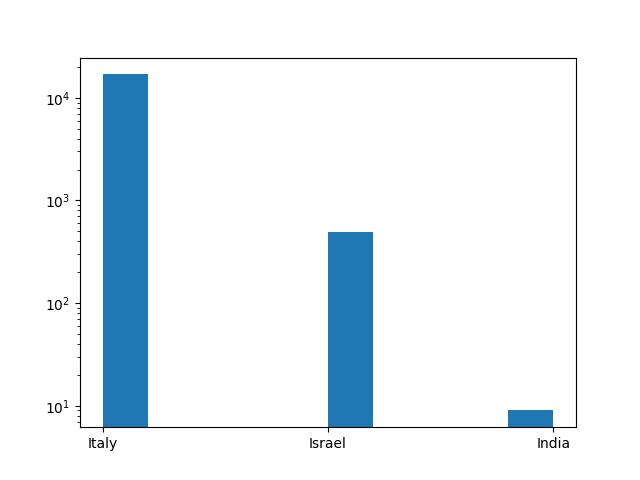
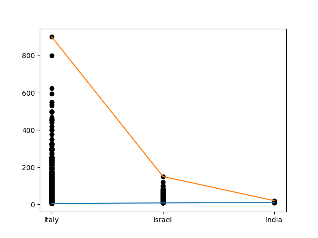

## Introduction 

Dans un fichier tiers exécutable en **Python**, saisissez vos commandes afin de résoudre les différentes question posées ci-après.

N'oubliez pas de mettre tout texte additionnel en commentaire (en utilisant le symbole `#`).

Ouvrez le fichier csv `./datasets/winemag-data-130k-v2.csv` et réalisez toutes les opérations nécessaires pour analyser les données.

## 1.

Dans la variable `info_clean`, stockez le jeu de données nettoyé de toutes ses valeurs nulles dans les champs `price` et `points`.

```
(120975, 13)
```

## 2.

En continuant, dans la variable `vin_i`, filtrer sur l'ensemble des vins de manières à ne conservez que ceux dont le nom du pays de production commence par la lettre `i`.

```
(17412, 13)
```

## 3.

Affichez dans une représentation de type histogramme, la distribution du nombre de vin pour chaque pays. Adaptez la visualisation de manière à ce que l'axe des ordonnées utilise une échelle logarithmique.



## 4.

Créez la représentation montrant pour chaque pays l'ensemble des prix pratiqués pour les vins en originant, que vous colorez en noir, ainsi que des courbes englobant ces valeurs et indiquant les prix maximum et minimum.




## Continuons

Nous pouvons passer à la [suite du cours](./8_regression_computation.md).


