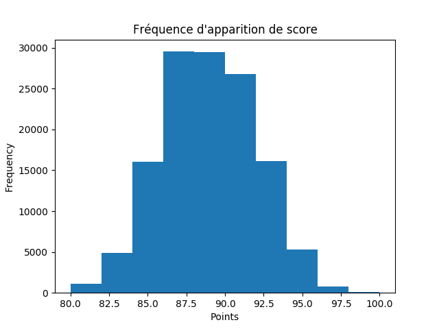
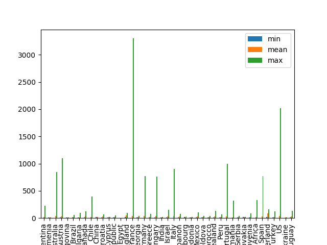
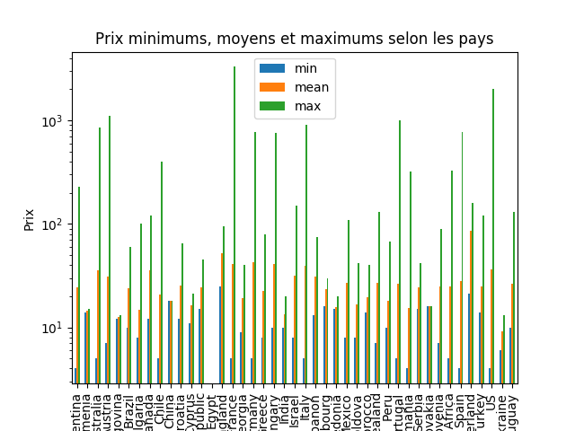
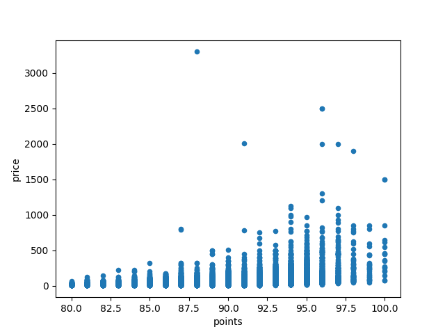

## Concepts généraux

De la même manière que R, python est capable de générer des représentations graphiques. Plusieurs librairies remplissant cet office telles que *gnuplot*, *ggplot2*, *plotutils* ou *orange* sont disponibles gratuitement. Dans notre cas, nous allons travailler avec **matplotlib**. 

De la même manière qu'avec les représentations générées avec R par ligne de commandes, matplotlib utilise un principe de "buffer" dans lequel les informations sont stockés avant que le résultat final ne soit généré.

Commençons par importer les librairies nécessaires à notre exemple: matplotlib, ici défini avec l'alias `mpl`, et numpy.

```python
import matplotlib.pyplot as mpl
import numpy
```

Nous utilisons numpy pour la génération des données d'exemple.

```python
x = numpy.linspace(0, 2, 100)
```

Les différentes courbes sont générées en fonction de leur valeur sur l'abscisse (`x`) et les ordonnées correspondantes (`x`, `x**2` et `x**3`).

```python
mpl.plot(x, x, label='linear')
mpl.plot(x, x**2, label='quadratic')
mpl.plot(x, x**3, label='cubic')
```

Nous pouvons ensuite spécifier les valeurs à utiliser pour décrire les courbes dans la légende.

```python
mpl.xlabel('x label')
mpl.ylabel('y label')

mpl.title("Simple Plot")

mpl.legend()
```

Une fois que toutes les valeurs sont spécifiées, nous pouvons lancer l'instruction pour générer le graphique souhaité.

```python
mpl.show()
```

Nous obtenons en résultat l'image suivante.


Si vous le souhaitez, il est également possible de sauvegarder l'image à générer plutôt que de l'afficher. Nous utilions alors la fonction `savefig`.

```python
mpl.savefig('./example.png', format='png')
```

## Utilisation avec pandas

La librairie matplotlib en elle même propose énormément de fonctionnalités à tel point qu'il est facile de s'y perdre. Cependant, nous avons le gros avantage de pouvoir utiliser **panda** pour simplifier notre travail dans un premier temps.

Les DataFrames et Series généres par pandas peuvent être directement utilisés comme points de départ pour la création de représentations. Dans le cas des Series, les graphiques peuvent souvent être obtenus sans argument, la librairie ne se basant alors que sur les valeurs de la Series ou leur nombre d'occurence. La création d'un histogramme, avec `plot.hist`, suivant le nombre de fois où chaque note a été donné peut être réalisée comme suit.

```python
info_vin.points.plot.hist()
mpl.xlabel('Points')
mpl.title("Fréquence d'apparition de score")
mpl.show()
```

Et nous obtenons le résultat ci-dessous.



Le même genre d'opération peut être appliquée sur une DataFrame, comportant donc des données multiples, en utilisant la méthode `plot.bar`. En réutilisant certaines des opérations vues auparavant, nous créons une DataFrame résumant les valeurs des prix des vins groupés en fonction de leur pays.

```python
info_vin.groupby('country').price.agg(['min', 'mean', 'max']).plot.bar()
mpl.show()
```

Ce qui produit l'image suivante.



Comme nous pouvons le constater, le résultat n'est pas forcément idéal et ne rendrait pas très bien dans un rapport sérieux. Il n'appartient qu'à nous de nous assurer que le rendu est à la hauteur. Nous pouvons rajouter plusieurs améliorations comme changer l'organisation des valeurs présentées, adapter les échelles des axes et rajouter labels et titre à notre figure.

```python
info_vin.groupby('country').price.agg(['min', 'mean', 'max']).sort_index().plot.bar()
mpl.yscale('log')
mpl.xlabel('Pays')
mpl.ylabel("Prix")
mpl.title("Prix minimums, moyens et maximums selon les pays")
mpl.show()
```

Nous générons l'image suivante.



Les données numérique peuvent présentées de différentes manières, que ce soit groupé par catégorie, aggrégée par valeurs similaire, etc. Lors des études de données, l'une des questions souvent posée concerne l'idée de corrélation entre deux ensembles de données. Ce genre d'information est souvent visuellement inspecté à l'aide de *scatterplots*.

Par exemple, nous souhaitons réaliser un scatterplot représentant le lien entre le nombre de points de chaque vin et leur prix.

```python
info_vin.plot.scatter(x='points',y='price')
mpl.show()
```

Ce qui nous donne:



Ces représentations nous montre rapidement les tendances pouvant exister et les cas particuliers qui se démarquent et ne sont peut être pas des éléments représentatifs; ils sont souvent appelés des "outliers".


## À vous de jouer

C'est maintenant votre tour de vérifier vos acquis en réalisant les [exercices suivants](./7_exercice.md)

