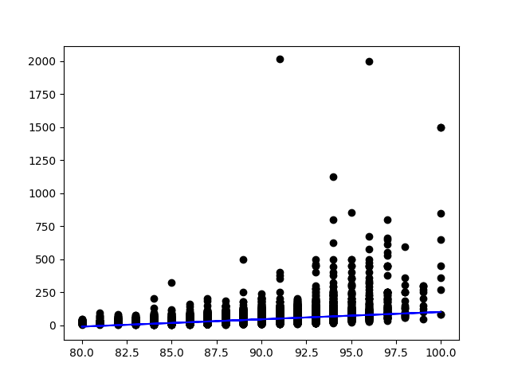

## Introduction aux régressions

Une fois nos données organisées avec pandas et visualisables avec matplotlib, il est temps pour nous de réaliser l'analyse de nos données. Plusieurs possibilités s'offrent à nous selon le type de résultat que nous pouvons souhaiter obtenir. Nous réalisons ci-après des opérations de régressions sur nos données.

Une régression est une opération mathématique qui nous permet de calculer simplement une tendance identifiable statistiquement dans nos données. Ce genre d'analyse est très souvent réaliser de manière automatique sans réelle compréhension des opérations réalisées en arrière plan.

Même si nous n'entrerons pas dans les détails d'implémentation dans ce cours, il est important de savoir que les opérations de régressions, notamment celles retournant de simples approximations linéaires, peuvent être abusées par les données et nous retourner des résultats similaires pour des ensembles de données très différents. Le cas du [quartet d'Anscombes](https://en.wikipedia.org/wiki/Anscombe%27s_quartet) illustre ce point parfaitement:


```
Property                                                                   Value    Accuracy
-------------------------------------------------------------------------------------------------------
Mean of x                                                                      9    exact
Sample variance of x : \sigma^2                                               11    exact
Mean of y                                                                   7.50    to 2 decimal places
Sample variance of y : \sigma^2                                            4.125    ±0.003
Correlation between x and y                                                0.816    to 3 decimal places
Linear regression line                                         y = 3.00 + 0.500x    to 2 decimal places
Coefficient of determination of the linear regression : R^2                 0.67    to 2 decimal places
```

Les valeurs statistiques calculées pour `x` et `y` sont similaires, à une très petite approximation près, pour les quatre distributions.

## Utilisation de scikitlearn et préparation de nos données

Pour réaliser nos calculs, nous faisons appel à la librairie `scikitlearn`. Nous devons commencer par importer la librairie.

```python
import sklearn
from sklearn import linear_model
from sklearn.pipeline import make_pipeline
```

Nous utilisons les colonnes `points` et `price` pour réaliser notre analyse de régression. La première étape est de nettoyer les données en enlevant toutes les valeurs non définies (par exemple `NaN`).

```python
clean_info = info_vin.loc[(info_vin.points.notnull() & info_vin.price.notnull())]
clean_info.shape
```

```
(120975, 13)
```

Nous procédons ensuite en séparant notre jeu de données entre un ensemble de valeurs qui sera utilisé pour l'apprentissage et un ensemble de valeurs réservé pour la vérification de notre régression.

```python
X_train = clean_info.points[:100000].to_numpy()
X_test = clean_info.points[100000:].to_numpy()

Y_train = clean_info.price[:100000].to_numpy()
Y_test = clean_info.price[100000:].to_numpy()
```

Nous isolons les 100 000 premiers éléments comme base d'apprentissage. Nous utilisons `numpy` pour réorganiser les ensembles de données pour qu'ils soient compréhensibles par les fonctions de `sklearn`.

```python
X_train = X_train.reshape(X_train.size,1)
X_test = X_test.reshape(X_test.size,1)
```

## Régression linéaire 

La régression linéaire est la méthode la plus simple (mais aussi la moins précise) pour obtenir une indication de la tendance sous-jacente dans les données. Son utilisation se découpe en deux phases: d'abord l'apprentissage (`fit`), puis la prédiction appliquée sur un jeu de test (`predict`).

```python
regression = linear_model.LinearRegression()
regression.fit(X_train, Y_train)
Y_prediction = regression.predict(X_test)
```

Il est possible de récupérer les informations caractérisant et qualifiant la prédiction réalisée, soit en analysant la régression calculée ou en comparant les données prédites à notre ensemble de test.

```python
# coefficient
regression.coef_
# mean square error
sklearn.metrics.mean_squared_error(Y_test, Y_prediction)
# coefficient of determination
sklearn.metrics.r2_score(Y_test, Y_prediction)
```

L'affichage de la régression linéaire peut se faire comme suit:

```python
mpl.scatter(X_test, Y_test, color='black')
mpl.plot(X_test, Y_prediction, color='blue')
mpl.show()
```





## À vous de jouer

C'est maintenant votre tour de vérifier vos acquis en réalisant les [exercices suivants](./8_exercice.md)

